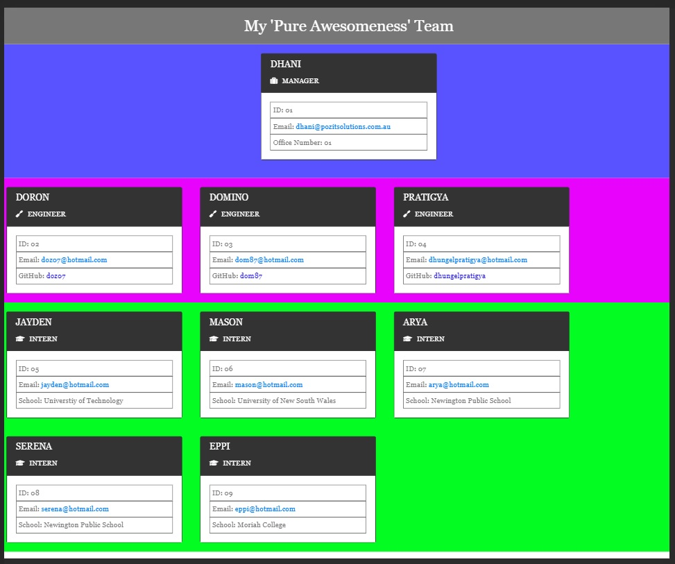
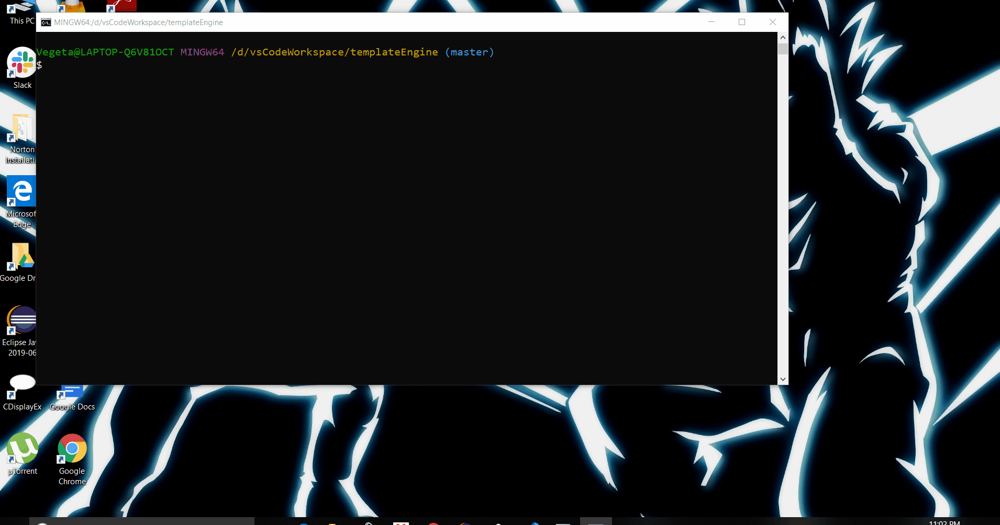

# templateEngine

Summary

The web application is a template engine that enables the user to build a team of employees
and displays a dataset depending on the chosen role of the employee. In this application the
team can consist of:
- Manager
- Engineer
- Intern
The user will be asked a set of questions determining the number of employees in the team and
how many of each role will be allocated to the team. The application uses validation methods to
ensure that the user inputs acceptable data. For example, providing a valid email address. The
answers will then be used to create new employees. The application uses classes and subclasses
in order to create new employees and push them to their respective role arrays. Once the user
has completed inputting the data, the application takes the data and creates cards for each
employee which is inserted into a template html file. The user can then open the file in the
browser displaying their team. 

The application uses jest to test whether the classes of the employees have been created correctly.
Once the application has passed all tests, the developer can continue to develop their code knowing
that it should run as intended. The following npm's and methods where used in the development of
this application:
- fs
- open
- inquirer
- node-html-parser
- module.exports
- debuggex
- .gitignore

Getting Started

Can watch the application in use by viewing the videoApp

Download and clone the repository from GitHub using the following command:

git clone https://github.com/pozengineer/templateEngine.git

In the terminal type in the command
npm run test: To run jest in order to test the object classes
node app.js: To run the application

This application was built using:
- HTML: HyperText Markup Language that allows the developer to describe pages
- CSS: Style Sheet Language that allows the developer to style an HTML document
- BootStrap: Library of HTML and CSS files and code https://getbootstrap.com/
- API: Application Programming Interface, which is a software intermediary that
  allows two applications to talk to each other.
- Node.js: An open-source, cross-platform, JavaScript runtime environment that
  executes JavaScript code outside of a browser.

